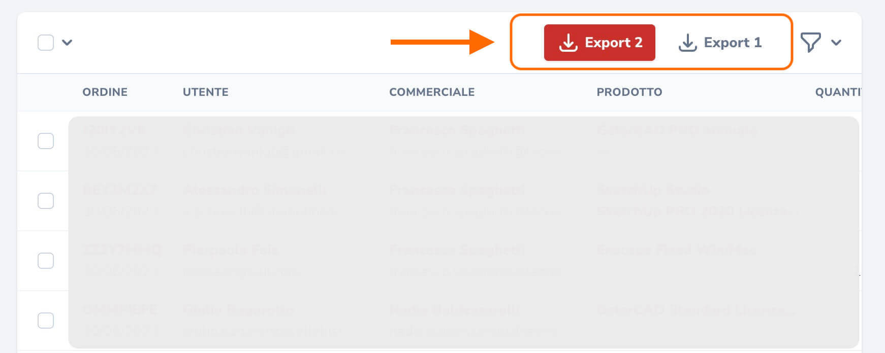
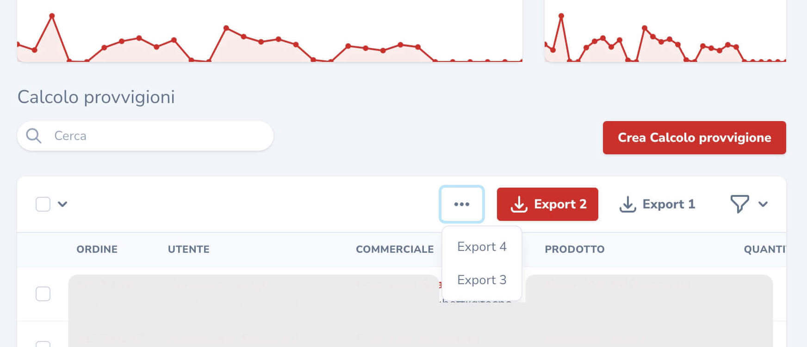

[](https://packagist.org/packages/datomatic/nova-detached-actions)
[](https://packagist.org/packages/datomatic/nova-detached-actions)
# Laravel Nova Detached Actions Tool

A Laravel Nova tool to allow for placing actions in the Nova toolbar, detached from the checkbox selection mechanism.

The action is detached from the row selection checkboxes in the resource table, so you will not have a collection of models to iterate over. 
Detached actions are intended to be independent of the selection in the table.

This is a fork of [gobrightspot/nova-detached-actions](https://github.com/gobrightspot/nova-detached-actions) abandoned repo, i rewrite a lot of part in using vue 3 composition api. 

:warning: Pivot actions are not supported and have not been tested.




Mobile compatibility


## Installation

You can install the package in to a Laravel app that uses [Nova](https://nova.laravel.com) via composer:

```bash
composer require datomatic/nova-detached-actions
```

The tool will be automatically registered via the `ToolServiceProvider`

## Usage

Create a custom Nova Action file:

```bash
php artisan nova:action ExportUsers
```

Instead of extending the `ExportUsers` class with the `Laravel\Nova\Actions\Action` class, swap it with the `Datomatic\Nova\Tools\DetachedActions\DetachedAction` class.

Since we won't receive a collection of `$models`, you can remove the variable from the `handle` method, so that the signature is `public function handle(ActionFields $fields)`.

After registration the detached action will appear on the Index Toolbar.


Here's a full example:

```php
<?php

namespace App\Nova\Actions;

use Datomatic\Nova\Tools\DetachedActions\DetachedAction;
use Illuminate\Bus\Queueable;
use Illuminate\Queue\SerializesModels;
use Illuminate\Queue\InteractsWithQueue;
use Illuminate\Contracts\Queue\ShouldQueue;
use Laravel\Nova\Fields\ActionFields;

class ExportUsers extends DetachedAction
{
    use InteractsWithQueue, Queueable, SerializesModels;
    
    public function name(): string
    {
        return __('Export Users');
    }

    /**
     * Perform the action.
     *
     * @param  ActionFields  $fields
     *
     * @return mixed
     */
    public function handle(ActionFields $fields)
    {
        // Do work to export records

        return DetachedAction::message('It worked!');
    }

    /**
     * Get the fields available on the action.
     *
     * @return array
     */
    public function fields()
    {
        return [];
    }
}
```

Register the action on your resource:

```php
/**
 * Get the actions available for the resource.
 *
 * @param  \Illuminate\Http\Request  $request
 * @return array
 */
public function actions(Request $request)
{
    return [
        new App\Nova\Actions\ExportUsers // or App\Nova\Actions\ExportUsers::make() 
    ];
}
```


### Customizing Buttons

### Visible vs Invisible Buttons

By default, the component will show the first 3 buttons and put the rest into a dropdown menu.
In the dropdown menu you can't add icon or extra classes because it use the nova dropdown component.
If you want to change the number of buttons visible per resource, you can do so by using the `additionalInformation` method, like so:

```php
public static function additionalInformation(Request $request)
{
    return [
        'visibleActionsLimit' => 2
    ];
}
```


### Customizing Button Classes

The package ships with some common sense default HTML classes that are applied to the action buttons. In the component, we automatically assign the following:

```
hover:bg-gray-200 dark:hover:bg-gray-900 flex-shrink-0 rounded focus:outline-none focus:ring inline-flex items-center font-bold px-3 h-9 text-sm flex-shrink-0
```

A developer can add classes on the fly, using the `extraClasses()` method on the `DetachedAction` class.

### The `extraClasses()` method

You are free to use any tailwind/nova class.

```php
return [
   (new ImportUsers)->extraClasses('bg-primary-500 text-white hover:black')
];
```
### The `$defaultClasses` variable

You can also extend `DetachedAction` class and change the default classes on `$defaultClasses` variable.

For example, you can add the classes to be equal to nova primary button

```
shadow ring-primary-200 dark:ring-gray-600 bg-primary-500 hover:bg-primary-400 dark:hover:bg-primary-400 active:bg-primary-600 text-white dark:text-gray-800
```


### Adding an icon

You can use any of the [104 Heroicon icons](https://v1.heroicons.com/) by specifying the icon name in lowercase:

```php
return [
   (new ImportUsers)->icon('add')
];
```

You can also customize the display of that icon using `iconClasses`:

```php
return [
   (new ImportUsers)->icon('upload')->iconClasses('mr-3 -ml-2')
];
```


## Chunking and repetitive calls to the handle()
If you initiate an action on the background Nova will chunk up the total amount of records and call the `handle()` function of your DetachedAction for each chunk. 
This could have unexpected performance impact as the system will perform your action for each chunk of records.
This happens in the `handleRequest()` function of `\Laravel\Nova\Actions\Action.php`.

To prevent this the simplest way is to overrule this function in your `DetachedAction`. this is a bare example dispatching just a job without any checks or other logic:

```php
/** @return array<int,string> */
public function handleRequest(ActionRequest $request): array
{
    dispatch(new GenerateTicketReport($request->resolveFields()));
    return DetachedAction::message('Nice job!');
}
```

## Usage with the Laravel Nova Excel `DownloadExcel` action

You can easily integrate the `DetachedAction` tool with the [Laravel Nova Excel](https://github.com/Maatwebsite/Laravel-Nova-Excel) `DownloadExcel` action by simply passing some additional data along using `withMeta()`.

```php
/**
  * Get the actions available for the resource.
  *
  * @param  \Illuminate\Http\Request  $request
  * @return array
  */
 public function actions(Request $request)
 {
     return [
         (new DownloadExcel)->withHeadings()->askForWriterType()->withMeta([
             'detachedAction' => true,
             'label' => 'Export',
             'name' => 'Export',
             'showOnIndexToolbar' => true
         ])->confirmButtonText('Export'),
     ];
 }
 ```


## License

The MIT License (MIT). Please see [License File](LICENSE) for more information.


